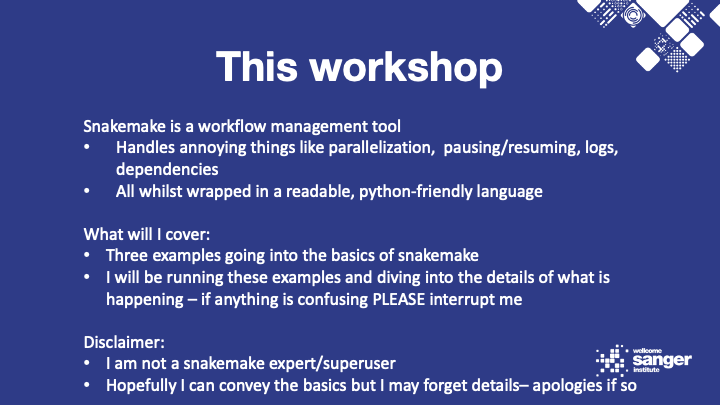
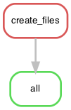
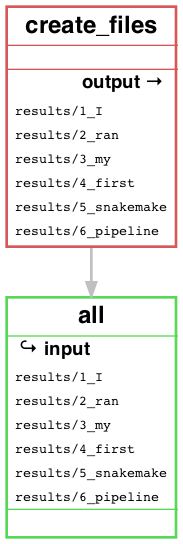
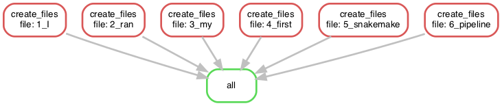

# Snakemake introduction and simple pipelines



## What this will cover

* Installation and writing simple snakemake rules and pipelines
* The snakemake tutorial from the snakemake website
* Utilising conda environments for rules
* Submitting jobs with snakemake

## What this won't cover

* Cloud (AWS/Google cloud) execution
* Singularity/Docker containers
* Checkpoints
* Unit testing
* Pros/Cons of Snakemake versus Nextflow, Cromwell, Luigi, etc
* Any other advanced snakemake trickery


## Installation

Official reccomendation is to install with mamba (faster version of conda) but I had no issues doing this:
```
conda create -n snake-env snakemake -c conda-forge -c bioconda
conda activate snake-env
```

# Snakemake workshop

## Example 01 - Hello (Snakemake) world!

Executing a very simple Snakefile and then breaking down how the same end result can be approached in three different ways as well as the main flags/options do.

### Snakefile

Very simple one-rule snakemake pipeline, clearly illustrating the basic language and syntax.

```bash
cd 01_hello-snakemake-world
snakemake -npr
snakemake
```

What does `-n` do? Dry run.

What does `-p` do? Print commands to be executed.

What does `-r` do? Prints the REASON each rule needs to be run.

Running `snakemake -j 1` will execute the pipeline in `Snakefile` by running all the rules that lead to the input for `rule all` being generated. 

Below is the DAG generated by snakemake for `Snakefile` and beneath that is the filegraph showing the input and output:





These can be made for any snakemake pipeline with:
```bash
snakemake --dag | dot -Tpng > name-of-dag.png
snakemake --filegraph | dot -Tpng > name-of-dag.png
```

### wildcards.smk

The same output as above but written in a more "snakemakey" way introducing wildcards and the expand function.

```bash
rm -r results
snakemake -s wildcards.smk -npr
snakemake -s wildcards.smk
```

Expand works similarly to format in python and will create a list exactly as seen in `Snakefile`. Wildcards however will cause multiple versions of a rule to be generated, each with a different match to the wildcard i.e. the commands will be ran as follows depending on which you use:

```bash
# Wildcards
touch results/1_I
touch results/2_ran
touch results/3_my 
...
```

```bash
# Expand/Listing the files
touch results/1_I results/2_ran results/3_my ...
```



### loop.smk

This snakefile introduces the pythonic aspect to Snakemake. Normal python code works in a snakefile and this can be used to simplify and extend snakemake's main functionality.

```bash
rm -r results
snakemake -s loop.smk -npr
snakemake -s loop.smk
```

Input can be generated with list comprehension or read in and manipulated with pandas and numpy. List comprehension can be used to make input or output lists and rules themselves (if unnamed) can be placed in loops to emulate wildcards and sometimes achieve otherwise difficult functionality.

### practical.smk

The task here is to complete `practical.smk` to produce the same output as the three other snakefiles but without using wildcards or loops (i.e. only expand).

```bash
rm -r results
```

Solution can be found in the `solutions` branch:

```bash
git checkout solutions
```

## Example 02 - Plot some words

Stepping things up a notch, passing input and output between multiple rules and integrating R scripts into Snakemake.

We have three books in `02_plot-some-words/data` - Alice in Wonderland, Peter Pan, and The Adventure of Sherlock Holmes. We want to know how often certain words appear in these books.

### Snakefile

```bash
cd 02_plot-some-words
snakemake -npr
snakemake
```

The words we're interested in are 'solved', 'hook', 'queen', 'fly', 'London', and 'rabbit'. We can do a simple `grep` for these words in each of our books then make a barplot with R.

The barplot can interact with snakemake input and output variables directly via a data structure but you can also pass parameters with optparse, if you prefer this.

### with_config.smk

Here I introduced configs which allow you to change your snakemake variables without directly modifying the code. You could also use pandas to read in a csv or tsv as pandas is installed with snakemake but I'm using the config yml in this example.

```bash
rm -r plots
rm -r results
snakemake -s with_config.smk --configfile config.yml -npr
snakemake -s with_config.smk --configfile config.yml
```

Within my config file I've used a dictionary structure that allows me to only search relevant words for each book e.g. 'hook' in Peter Pan or 'mad' in Alice in Wonderland. This dictionary is then accesed with wildcards in the snakefile using lambda.

### practical.smk

Here I have broken down the single rule from the previous snakefiles into two, where the first now searches a single word. This is for parallelisation purporses and probably isn't necessary for a simple grep but for other bioinformatics uses this can be very helpful so is a good example.
You must complete `practical.smk` by adding a new rule. It involves combining expand and wildcards.

```bash
rm -r results
rm -r plots
```

Solution can be found in the `solutions` branch:

```bash
git checkout solutions
```

## Example 03 - Snakemake tutorial

The official Snakemake tutorial taken from their documentation. It is a very simple read mapping and variant calling pipeline. I've sprinkled in a few extras here and there that aren't part of the tutorial to hopefully pad it out a little bit more.

### Snakefile

The only change I've made here versus the official tutorial is the inclusion of `conda:` which allows us all to run this example locally without having to install any of the tools we need manually.

```bash
snakemake -npr
snakemake --use-conda
```

With the `--use-conda` flag, snakemake will install a local conda environment using the environment yaml file provided for each rule. You can have one environment for all the rules or a separate environment for each. Docker and Singularity can be used in a similar manner here but I haven't covered that.

Note: Some input here isn't used directly e.g. `.bai` files. This tells snakemake not to start executing these rules until those files exist.

### modularised.smk

This example shows how large pipelines can be broken down into modules. This tidies up long snakemake pipelines a bit, allows for sharing of code between pipelines as well as simplifies the process of running only a small part of a pipeline.

```bash
rm -r mapped_reads
rm -r sorted_reads
rm -r plots
rm -r calls
conda activate [path to just created conda env]
[path to snakemake]/snakemake -s modularised.smk -npr
[path to snakemake]/snakemake -s modularised.smk
```

We don't have to use conda envs for dependencies as long as the tools we need are in our PATH it will still run. Here I activate the conda env we just created, hence adding all of the tools to my PATH, and then execute the pipeline without the flag `--use-conda` or `conda:` in the snakefile.

I've also included an example of using flags with your scripts rather than the snakemake object as well as the `temp` function which will delete intermediary files as soon as they're no longer needed.

### practical.smk

Final interactive part: I've decided I'd like to plot the SNP data and INDEL data separately - can you make a new rule to divide this data and then modify the `plot_quals` rule and `rule all` to fit this new change. 

The commands you will need are:
```bash
bcftools view --types snps results/all.vcf
bcftools view --types indels results/all.vcf
```

Activate your previously made conda env and give the commands a spin on `results/all.vcf` if you're not familiar with bcftools.


## Extra details

### Running snakemake on a cluster

I don't have access to a SLURM cluster job submission system so will have to use LSF as an example but it's very straightforward, see [here](https://github.com/snakemake-profiles/doc) for how to set-up.
Once set-up submitting jobs instead of executing locally is as simple as
```bash
snakemake --profile lsf
```

And it will submit jobs with the default resources specified upon set-up or in your local `lsf.yaml` file. If you have a local file these resources/flags can be customised on a rule-by-rule basis.

### Speeding up DAG generation

One of Snakemake's biggest flaws is that when working with complex DAGs consisting of tens to hundreds of thousands of files it can sometimes take a while to compute the initial DAG. One way of speeding this up can be to split your jobs into batchs with the batch flag:

```bash 
snakemake -j 4 --batch myrule=1/3
```

You specify the rule you think is the bottleneck and the input for it will be split into batches to hopefully speed up the DAG generation.